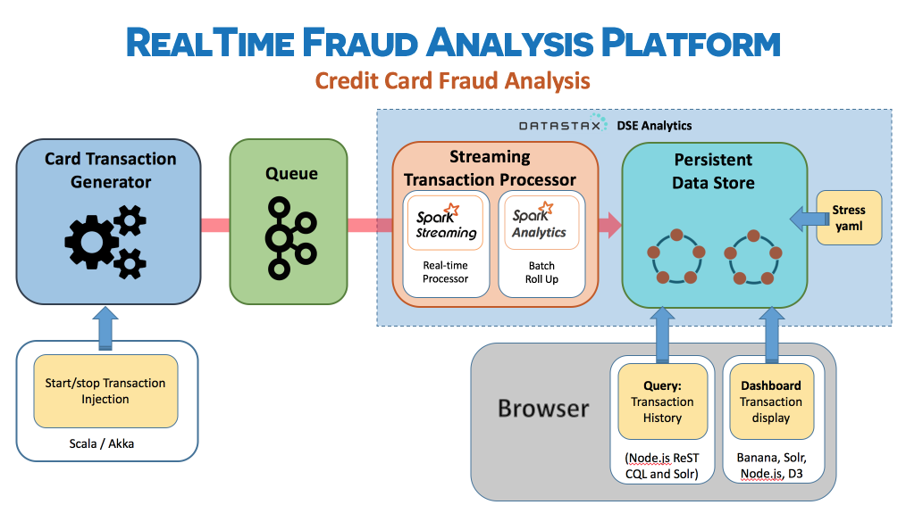
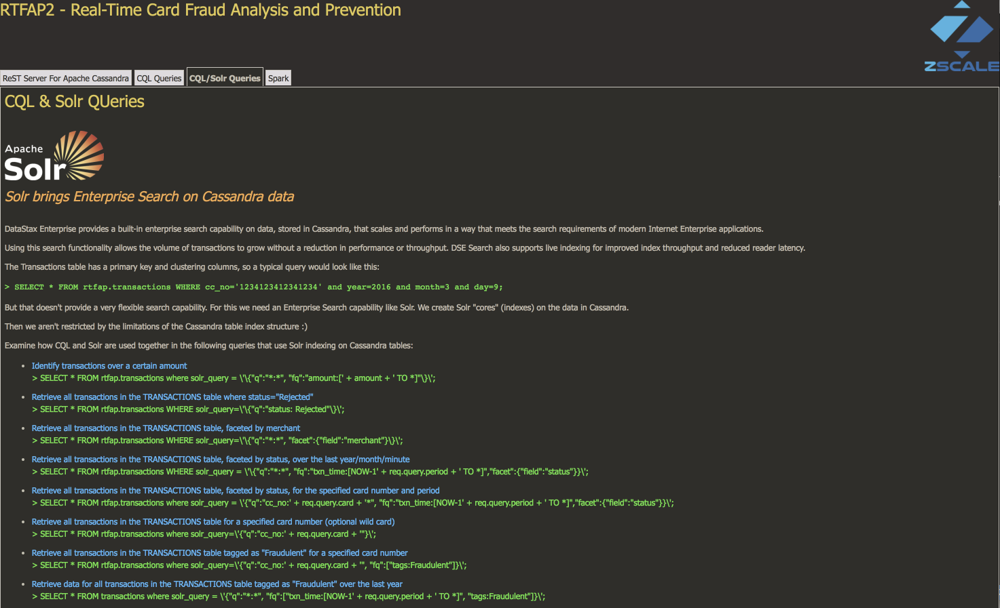

# RTFAP2 - Real-time Fraud Analysis Platform

How to use modern, real-time, distributed streaming technologies to build a working model of a scalable fraud-detection platform. This demo will use these technologies:

- Cassandra
- Spark
- Scala
- Akka
- Solr
- Banana
- Zeppelin

<p>
<p align="center">
  
</p>


## Use Case 
A large bank wants to monitor its customers creditcard transactions to detect and deter fraud attempts. They want the ability to search and group transactions by credit card, period, merchant, credit card provider, amounts, status etc.

The client wants a REST API to return:  

- Identify all transactions tagged as fraudulent in the last minute/day/month/year.
- Identify all transactions tagged as fraudulent for a specific card.
- Report of transactions for a merchant on a specific day.
- Roll-up report of transactions by card and year.
- Search capability to search the entire transaction database by merchant, cc_no, amounts.
- The ratio of transaction success based on the first 6 digits of their credit card no.     
- The ratio of confirmed transactions against fraudulent transactions in the last minute.
- A moving ratio of approved transactions per minute, per hour.
- A count of approved transactions per minute, per hour.

They also want a graphic visualisation - a dashboard - of the data.

## Performance SLAs:
- The client wants an assurance that the data model can handle 1,000 transactions a second with stable latencies.
- The client currently handles accounts for over 15000 merchants and hopes to grow to 50,000 in a year.


## Setup 
DataStax Enterprise provides a built-in enterprise search capability on data, stored in Cassandra, that scales and performs in a way that meets the search requirements of modern Internet Enterprise applications. 
Using this search functionality allows the volume of transactions to grow without a reduction in performance or throughput. DSE Search also supports live indexing for improved index throughput and reduced reader latency. 

We will need to start DSE in Analytics and Search mode
- Analytics to allow us to use the integrated Spark feature, and 
- Search mode to allow us to use the search functionalities that we need on top of Cassandra. 

An install of DataStax Enterprise 5.1.4 will default to an installation configuration that enables Search (Solr), Analytics (Spark) and Graph. 

>If you are  changing the enabled products on a node you will need to delete the default datacentre and restart the cluster in SearchAnalytics mode.

## Install information 

> Set up and install DataStax Enterprise with Spark and Solr enabled using the DSE installation and set up instructions for your platform [http://github.com/simonambridge/RTFAP2/tree/master/DSE_Setup.md](http://github.com/simonambridge/RTFAP2/tree/master/DSE_Setup.md).

- This demo is based upon DSE 5.4.1.x with Spark 2.0.2, Scala 2.11, Kafka 1.0.0 and Akka 2.3.15
- This demo uses an installation running on MacOS Sierra 10.12, using the packaged install method from http://academy.datastax.com/downloads

After DSE has been installed your URLs will be: 
- Spark Master => http://[DSE_NODE_IP]:7080/ e.g. ```http://localhost:7080/```
- Solr admin page => http://[DSE_NODE_IP]:8983/solr/ e.g. ```http://localhost:8983/solr```

If you install DataStax OpsCenter:
- Opscenter => http://[DSE_NODE_IP]:8888/opscenter/index.html e.g. ```http://localhost:8888/opscenter/index.html```

When the ReST service is available:
- Node.js ReST interface => e.g. http://[DSE_NODE_IP]:3000 e.g. ```http://localhost:3000``` 

When the dashboard has been configured:
- Visual Dashboard => http://[DSE_NODE_IP]:8983/banana/#/dashboard e.g. ```http://localhost:8983/banana/#/dashboard```

(where [DSE_NODE_IP] is the public IP address of your single node DSE installation)

At this point your datacentre should be running in SearchAnalytics mode, nodetool status reports no errors and you can run cqlsh.

<h2>Clone the RTFAP2 repository</h2>

Finally, clone this repo to a directory on the machine where you installed DSE:
```
$ git clone https://github.com/simonambridge/RTFAP2
```

<h2>Data Model</h2>

We will need multiple tables to fulfill the above query patterns and workloads. De-normalization is a good thing with NoSQL databases - it allows you to optimise your Cassandra schema specifically to enable extremely fast queries.

For testing purposes we will use a single DC with one node and RF=1. 
For a production deployment we recommend a multi-datacenter Active-Active HA setup across geographical regions with RF=3.
```
create keyspace if not exists rtfap WITH replication = {'class': 'SimpleStrategy', 'replication_factor': '1' };
```

To create this keyspace and the tables described below, run the create schema script:
```
cqlsh <node name or IP>
cqlsh> source 'creates_and_inserts.cql'
```
This creates the following tables:

- Table Transactions - main transactions table
We will create a Solr index on transactions to support a variety of ReST API queries.

- Table hourlyaggregates_bycc - hourly roll-up of transactions by credit card

- Table dailyaggregates_bycc - daily roll-up of transactions by credit card

- Table monthlyaggregates_bycc - monthly roll-up of transactions by credit card

- Table yearlyaggregates_bycc - yearly roll-up of transactions by credit card

- Table dailytxns_bymerchant - daily roll-up of transactions by merchant

- Table txn_count_min - track transactions in a rolling window for analytics

We will create a Solr index on txn_count_min to enable flexible reporting and charting.

The create script also creates some sample data for example:

```
insert into rtfap.transactions (year, month, day, hour, min, txn_time, cc_no, amount, cc_provider, items, location, merchant, notes, status, txn_id, user_id, tags) VALUES ( 2016, 03, 09, 12, 30, '2016-03-09 12:30:00', '1234123412341237', 1500.0, 'AMEX', {'clothes':1500}, 'New York', 'Ann Taylor', 'frequent customer', 'Approved', '876302', 'caroline', {'HighValue'});
```

## Sample queries

We can now run CQL queries to look up all transactions for a given credit card (`cc_no`). 
The Transactions table is primarily write-oriented - it's the destination table for the streamed transactions and used for searches and we don't update the transactions once they have been written.
The table has a primary key and clustering columns so a typical query would look like this:
```
SELECT * FROM rtfap.transactions WHERE cc_no='1234123412341234' and year=2016 and month=3 and day=9;
```
The roll-up tables can also be queried - for example transactions for each merchant by day use the dailytxns_bymerchant table.
>The roll-up tables will be empty at this point - they get populated using the Spark batch and streaming analytics jobs that we run later.
```
SELECT * FROM rtfap.dailytxns_bymerchant where merchant='Nordstrom' and day=20160317;
```

## Searching Data in DSE 

The above queries allow us to query on the partition key and some or all of the clustering columns in the table definition. To query more generically on the other columns we will use DSE Search to index and search our data.

### Create Solr Cores 
To do this we use the dsetool to create a Solr core based on the Transactions table. In a production environment we would only index the columns that we would want to query on (pre-requisite: run the CQL schema create script as described above to create the necessary tables).

To check that DSE Search is up and running sucessfully go to http://[DSE node]:8983/solr/

For example ```http://127.0.0.1:8983/solr/```

By default, when a Solr core is created, resources will not be generated and existing data is not re-indexed - the intention being that you can check and customize the resources before indexing. To override the default and reindex existing data, use the reindex=true option, for example:

```
dsetool create_core rtfap.transactions generateResources=true reindex=true
```

Navigate to the Solr directory to create the Solr cores for our transaction data.

```
$ cd solr
$ ls
build_solr_indexes.sh	transactions.xml	txn_count_min.xml
```

Run the script ```build_solr_indexes.sh``` to create the indexes. The script will run the following commands:
```
dsetool create_core rtfap.transactions generateResources=true reindex=true
dsetool reload_core rtfap.transactions schema=./transactions.xml reindex=true

dsetool create_core rtfap.txn_count_min generateResources=true reindex=true
dsetool reload_core rtfap.txn_count_min schema=./txn_count_min.xml reindex=true
```
Note that we're using custom schema definitions for the cores that we're creating on the transactions and txn_count_min tables. 
We do this using custom xml schema definition files. 

For example the schema definition file ```txn_count_min.xml``` file contains the line:
```
<field indexed="true" multiValued="false" name="time" stored="true" type="TrieDateField" docValues="true" />
```
We're using the docValues option on the time column to allow us to sort on the time field.

### Using Solr with CQL
Now that we've created the Solr cores (lucene indexes) we can query our data in a number of ways. One is through cql using the solr_query column. The other is through a third party library like SolrJ which will interact with the search tool through ReST.

Below are the CQL Solr queries addressing some of the client requirements (and more) for searching the data in DSE. You can try these queries for yourself in cqlsh.

Get counts of transactions faceted by merchant or cc_provider.
```
SELECT * FROM rtfap.transactions where solr_query='{"q":"*:*", "facet":{"field":"merchant"}}';
SELECT * FROM rtfap.transactions where solr_query='{"q":"*:*", "facet":{"field":"cc_provider"}}';
```

Get transactions by first 6 digits of cc_no (and perhaps filter query it further by the status!).
```
SELECT * FROM rtfap.transactions where solr_query='{"q":"cc_no: 123412*",  "fq":"status: Rejected"}';
```

Get all the transactions tagged as Fraudulent in the last day and last minute.
```
SELECT * FROM rtfap.transactions where solr_query = '{"q":"*:*", "fq":["txn_time:[NOW-1YEAR TO *]", "tags:Fraudulent"]}';
```
When we start generating some live data we'll be able to analyse up-to-date information e.g.
```
SELECT * FROM rtfap.transactions where solr_query = '{"q":"*:*", "fq":["txn_time:[NOW-1MINUTE TO *]", "tags:Fraudulent"]}';
```
These samples demonstrate that full, ad-hoc search on any of the transaction fields is possible including amounts, merchants etc.
We will use queries like this to build the ReST interface. You can use cqlsh to explore the list of provided ReST queries here: http://github.com/simonambridge/RTFAP2/tree/master/Solr_Queries.md 

## Querying Data Using A ReST API with Node.js and D3

The sample queries are served by a web service written in Node.js. The code for this web service is provided in the repo.
ReST Web Interface

A ReSTful web interface provides an API for calling programs to query the data in Cassandra.

<p>
<p align="center">
  
</p>
The code for a this is in the restRTFAP directory provided in the repo. You will use a web browser interface to run the queries. Use the example url’s supplied - these will return a json representation of the data using the ReST service. 

The ReST Server set up details are described here: http://github.com/simonambridge/RTFAP2/tree/master/ReST.md

## Analyzing data using DSE Spark Analytics

DSE provides integration with Spark out-of-the box to enable analysis of data in-place on the same cluster where the data is ingested and stored. Workloads can be isolated and there is no need to ETL the data. The data ingested in a Cassandra-only (OLTP) data center can be automatically replicated to a logical data center of Cassandra nodes also hosting Spark Workers.

This tight integration between Cassandra and Spark offers huge value in terms of significantly reduced ETL complexity (no data movement to different clusters) and thus reducing time to insight from your data through a much less complex "cohesive lambda architecture" .

### Streaming Analytics

The streaming analytics element of this application is made up of two parts:

* A transaction "producer" - a Scala/Akka app that generates random credit card transactions and then places those transactions onto a Kafka queue. 
* A transaction "consumer" - also written in Scala, is a Spark streaming job that (a) consumes the messages put on the Kafka queue, and then (b) parses those messages, evalutes the transaction status and then writes them to the Datastax/Cassandra table `transactions`. It also generates rolling summary lines into the `txn_count_min` table every minute.

Streaming analytics code can be found under the directory `TransactionHandlers/producer` (pre-requisite: make sure you have run the CQL schema create script as described above to create the necessary tables).

Follow the Spark streaming installation and set up instructions here: https://github.com/simonambridge/RTFAP2/tree/master/TransactionHandlers/README.md

### Batch Analytics

Two Spark batch jobs have been included. 
* `run_rollupbymerchant.sh` provides a daily roll-up of all the transactions in the last day, by merchant. 
* `run_rollupbycc.sh` populates the hourly/daily/monthly/yearly aggregate tables by credit card, calculating the total_amount, avg_amount and total_count.

The roll up batch analytics code and submit scripts can be found under the directory `RollUpReports` (pre-requisite: run the streaming analytics first in order to populate the Transaction table with transactions).

Follow the Spark batch job installation and set up instructions here:https://github.com/simonambridge/RTFAP2/tree/master/RollUpReports/README.md


## Stress yaml 

Running a cassandra-stress test with the appropriate YAML profile for the table helps show how DSE will perform in terms of latency and throughput for writes and reads to/from the system.

You can read more about using stress yamls to stress test a data model  [here](http://www.datastax.com/dev/blog/improved-cassandra-2-1-stress-tool-benchmark-any-schema) and [here](http://docs.datastax.com/en/cassandra/2.1/cassandra/tools/toolsCStress_t.html).

The stress YAML files are in the [stress_yamls directory](https://github.com/simonambridge/RTFAP2/tree/master/stress_yamls).

The stress tool will inject synthetic data so we will use a different table specifically for the stress testing.

When you originally ran the ```creates_and_inserts.cql``` script to create the transaction and rollup tables you also created the dummy table ```txn_by_cc``` that will be used by cassandra-stress.

The YAML tries to mirror real data, for example: month is a value between 1 and 12, year is between 2010 and 2016, credit card number is 16 characters in length, etc. The text fields are filled with unreadable gibberish :)

cassandra-stress generates a lot of output as it repeatedly runs the write test (10,000 records) while increasing the number of threads. This allows you to view the optimum number of threads required to run the task.

An example of running the stress tool is shown below using [txn_by_cc_stress.yaml](https://github.com/simonambridge/RTFAP2/blob/master/stress_yamls/txn_by_cc_stress.yaml):

For inserts
```
cassandra-stress user profile=./txn_by_cc_stress.yaml ops\(insert=1\) cl=LOCAL_ONE n=100000 -rate auto -node 127.0.0.1
******************** Stress Settings ********************
Command:
  Type: user
  Count: 100,000
  No Warmup: false
  Consistency Level: LOCAL_ONE
  Target Uncertainty: not applicable
  Command Ratios: {insert=1.0}
  Command Clustering Distribution: clustering=gaussian(1..10)
  Profile File: ./txn_by_cc_stress.yaml
```
...
```
Connected to cluster: Test Cluster, max pending requests per connection 128, max connections per host 8
Datatacenter: SearchGraphAnalytics; Host: /127.0.0.1; Rack: rack1
Generating batches with [1..1] partitions and [0..100] rows (of [1..1] total rows in the partitions)

Sleeping 2s...
Warming up insert with 25000 iterations...
Thread count was not specified

Running with 4 threadCount
Running [insert] with 4 threads for 100000 iteration
type       total ops,    op/s,    pk/s,   row/s,    mean,     med,     .95,     .99,    .999,     max,   time,   stderr, errors,  gc: #,  max ms,  sum ms,  sdv ms,      mb
total,          1957,    1957,    1957,    1957,     0.6,     0.6,     1.0,     1.4,     4.1,     4.2,    1.0,  0.00000,      0,      0,       0,       0,       0,       0
total,          9200,    7243,    7243,    7243,     0.5,     0.5,     0.9,     1.4,     3.9,     8.5,    2.0,  0.40729,      0,      0,       0,       0,       0,       0
total,         17843,    8643,    8643,    8643,     0.4,     0.4,     0.7,     1.0,     3.6,    12.9,    3.0,  0.28055,      0,      0,       0,       0,       0,       0
total,         29181,   11338,   11338,   11338,     0.3,     0.3,     0.5,     0.6,     1.6,     4.1,    4.0,  0.23372,      0,      0,       0,       0,       0,       0
total,         40477,   11296,   11296,   11296,     0.3,     0.3,     0.5,     0.7,     1.9,     9.5,    5.0,  0.19039,      0,      0,       0,       0,       0,       0
total,         52611,   12134,   12134,   12134,     0.3,     0.3,     0.4,     0.4,     0.6,     4.0,    6.0,  0.16215,      0,      0,       0,       0,       0,       0
total,         64166,   11555,   11555,   11555,     0.3,     0.3,     0.4,     0.5,     1.1,    29.1,    7.0,  0.13946,      0,      0,       0,       0,       0,       0
total,         73958,    9792,    9792,    9792,     0.3,     0.3,     0.4,     0.4,     0.7,     4.1,    8.0,  0.12132,      0,      1,     285,     285,       0,    2037
total,         84188,   10230,   10230,   10230,     0.5,     0.3,     0.5,     0.6,     1.1,   286.8,    9.0,  0.11473,      0,      0,       0,       0,       0,       0
total,         95703,   11515,   11515,   11515,     0.3,     0.3,     0.4,     0.6,     1.1,     4.4,   10.0,  0.10276,      0,      0,       0,       0,       0,       0
total,        100000,   11688,   11688,   11688,     0.3,     0.3,     0.4,     0.5,     1.0,     3.9,   10.4,  0.09315,      0,      0,       0,       0,       0,       0


Results:
Op rate                   :    9,645 op/s  [insert: 9,645 op/s]
Partition rate            :    9,645 pk/s  [insert: 9,645 pk/s]
Row rate                  :    9,645 row/s [insert: 9,645 row/s]
Latency mean              :    0.4 ms [insert: 0.4 ms]
Latency median            :    0.3 ms [insert: 0.3 ms]
Latency 95th percentile   :    0.6 ms [insert: 0.6 ms]
Latency 99th percentile   :    0.8 ms [insert: 0.8 ms]
Latency 99.9th percentile :    2.5 ms [insert: 2.5 ms]
Latency max               :  286.8 ms [insert: 286.8 ms]
Total partitions          :    100,000 [insert: 100,000]
Total errors              :          0 [insert: 0]
Total GC count            : 1
Total GC memory           : 1.989 GiB
Total GC time             :    0.3 seconds
Avg GC time               :  285.0 ms
StdDev GC time            :    0.0 ms
Total operation time      : 00:00:10

Sleeping for 15s
```
    
You should see an improvement in op rate performance as the thread count increases:

```
Running with 8 threadCount
Running [insert] with 8 threads for 100000 iteration
type       total ops,    op/s,    pk/s,   row/s,    mean,     med,     .95,     .99,    .999,     max,   time,   stderr, errors,  gc: #,  max ms,  sum ms,  sdv ms,      mb
total,          8754,    8754,    8754,    8754,     0.5,     0.4,     1.2,     2.5,     8.7,    18.9,    1.0,  0.00000,      0,      0,       0,       0,       0,       0
total,         24726,   15972,   15972,   15972,     0.5,     0.4,     1.1,     2.3,     4.8,    10.1,    2.0,  0.20353,      0,      0,       0,       0,       0,       0
total,         40459,   15733,   15733,   15733,     0.5,     0.4,     1.1,     2.2,     5.8,    32.4,    3.0,  0.14378,      0,      0,       0,       0,       0,       0
total,         56556,   16097,   16097,   16097,     0.5,     0.4,     1.1,     2.0,     4.4,     7.3,    4.0,  0.10961,      0,      0,       0,       0,       0,       0
total,         70403,   13847,   13847,   13847,     0.6,     0.4,     1.0,     1.9,     5.1,   140.8,    5.0,  0.08817,      0,      1,     138,     138,       0,    1961
total,         86375,   15972,   15972,   15972,     0.5,     0.4,     1.0,     1.9,     4.9,    11.2,    6.0,  0.07374,      0,      0,       0,       0,       0,       0
total,        100000,   15652,   15652,   15652,     0.5,     0.4,     1.0,     2.1,     6.0,    20.3,    6.9,  0.06326,      0,      0,       0,       0,       0,       0


Results:
Op rate                   :   14,555 op/s  [insert: 14,555 op/s]
Partition rate            :   14,555 pk/s  [insert: 14,555 pk/s]
Row rate                  :   14,555 row/s [insert: 14,555 row/s]
Latency mean              :    0.5 ms [insert: 0.5 ms]
Latency median            :    0.4 ms [insert: 0.4 ms]
Latency 95th percentile   :    1.1 ms [insert: 1.1 ms]
Latency 99th percentile   :    2.1 ms [insert: 2.1 ms]
Latency 99.9th percentile :    5.6 ms [insert: 5.6 ms]
Latency max               :  140.8 ms [insert: 140.8 ms]
Total partitions          :    100,000 [insert: 100,000]
Total errors              :          0 [insert: 0]
Total GC count            : 1
Total GC memory           : 1.915 GiB
Total GC time             :    0.1 seconds
Avg GC time               :  138.0 ms
StdDev GC time            :    0.0 ms
Total operation time      : 00:00:06

Improvement over 4 threadCount: 51%
Sleeping for 15s
```

You can specify a fixed number of threads for a specific test, using multiple nodes:
```
cassandra-stress user profile=./txn_by_cc_stress.yaml ops\(insert=1\) cl=LOCAL_ONE n=100000 -rate threads=8 -node 10.0.0.4,10.0.0.5,10.0.0.7
```

For reads
```
cassandra-stress user profile=./txn_by_cc_stress.yaml ops\(singletrans=1\) -node 127.0.0.1

cassandra-stress user profile=./txn_by_cc_stress.yaml ops\(dailytrans=1\) -node 127.0.0.1

```
Examples are provided for [read](https://github.com/simonambridge/RTFAP2/blob/master/stress_yamls/stress-read.log) and [write](https://github.com/simonambridge/RTFAP2/blob/master/stress_yamls/stress-write.log) stress tests from my Mac Pro.

## Visual Dashboard - Lucidworks Banana

The Banana project was forked from Kibana, and works with all kinds of time series (and non-time series) data stored in Apache Solr. It uses Kibana's powerful dashboard configuration capabilities, ports key panels to work with Solr, and provides significant additional capabilities, including new panels that leverage D3.js.

Banana allows you to create rich and flexible UIs, enabling users to rapidly develop end-to-end applications that leverage the power of Apache Solr.

The dashboard below was created using Banana.


 
Follow this [guide](https://github.com/simonambridge/RTFAP2/tree/master/banana/Banana_Setup.md) to set it up.


<size="small">Acknowldegements: Based on the original RTFAP created with help from colleagues at DataStax.
Improvements since then include a Node.js/D3 ReST interface replacing Java, enhanced producer/consumer code, new roll-up reports, real time charts, demo ReST UI, etc
