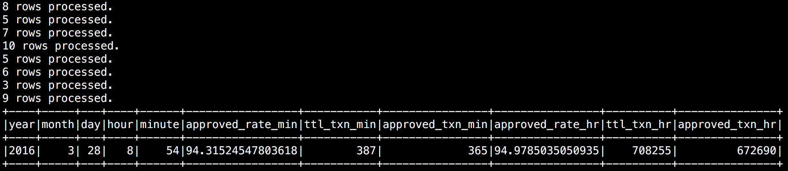

#Datastax Fraud Prevention Demo - Streaming Analytics

##Creating and Consuming Transactions

In this project (Idea IntelliJ) there are two different pieces
   
* Transaction Producer
* Transaction Consumer

The transaction producer Is a Scala app that leverages the Akka framework (Lightly) to generate random transactions and then place those transactions on a Kafka queue. There is some fairly trival yet fun logic for spreading the transactions proportionally across the top 100 retailers in the world based on total sales. It does a similar thing for the countries of the world based on population. This is here strictly to make pretty graphs.

The Transaction consumer, also written in Scala, is a Spark streaming job. This job performs two main tasks. First, it consumes  the messages put on the Kafka queue. It then parses those messages, evalutes the data and flags each transaction as "APPROVED" or "REJECTED". This is the place in the job where more application specific (or complex) logic should be placed. In a real world application I could see a scoring model used to decide if a transaction should be accepted or rejected. You would also want to implement things like black-list lookups and that sort of thing. Finally, once evaluated, the records are then written to the Datastax/Cassandra table.

The second part of the Spark job counts the number of records processed each minute and stores that data to an aggregates table. The only unique aspect of this flow is that the job also reads back from from this table and builds a rolling count of the data. The results should look something like this.

<p align="left">
  
</p>

##Demo tech set up

In order to run this demo, it is assumed that you have the following installed and available on your local system. (Please note, this demo is built using the 4.8.x branch of Datastax Enterprise as 5.0 was not GA. In the future you should use Datastax Enterprise 5.x as Spark Direct Streams (Kafka in this demo) support is much improved in this version.)

  1. Datastax Enterprise 4.8.x
  2. Apache Kafka 0.9.0.1, I used the Scala 2.10 build
  3. git
  4. sbt

##Getting Started with Kafka
Use the steps below to setup up a local instance of Kafka for this example. This is based on apache-kafka_2.10-0.9.0.1.

###1. Locate and download Apache Kafka

Kafka can be located at this URL: [http://kafka.apache.org/downloads.html](http://kafka.apache.org/downloads.html)

You will want to download and install the binary version for Scala 2.10 - you can use wget to download to the server:

```
$ wget http://apache.mirror.anlx.net/kafka/0.9.0.1/kafka_2.10-0.9.0.1.tgz
```

###2. Install Apache Kafka

Once downloaded you will need to extract the file. It will create a folder/directory. Move this to a location of your choice.

```
$ gunzip kafka_2.10-0.9.0.1.tgz
$ tar xvf kafka_2.10-0.9.0.1.tar
$ rm kafka_2.10-0.9.0.1.tar
$ mv kafka_2.10-0.9.0.1 /usr/share
```

###3. Start ZooKeeper and Kafka

Start local copy of zookeeper (in its own terminal or use nohup)

  * `<kafka home dir>bin/zookeeper-server-start.sh config/zookeeper.properties`

Start local copy of Kafka (in its own terminal or use nohup)

  * `<kafka home dir>bin/kafka-server-start.sh config/server.properties`

###4. Prepare a message topic for use.

Create the topic we will use for the demo

  * `<kafka home dir>bin/kafka-topics.sh --zookeeper localhost:2181 --create --replication-factor 1 --partitions 1 --topic NewTransactions`

Validate the topics were created. 

  * `<kafka home dir>bin/kafka-topics.sh --zookeeper localhost:2181 --list`
  
##A Couple of other useful Kafka commands

Delete the topic. (Note: The server.properties file must contain `delete.topic.enable=true` for this to work)

  * `<kafka home dir>bin/kafka-topics.sh --zookeeper localhost:2181 --delete --topic NewTransactions`
  
Show all of the messages in a topic from the beginning

  * `<kafka home dir>bin/kafka-console-consumer.sh --zookeeper localhost:2181 --topic NewTransactions --from-beginning`
  

## Build the demo

###In order to run this demo navigate to the TransactionHandlers directory

  * You should have already created the Cassandra keyspaces and tables using the main creates_and_inserts.cql script
  * If you havent yet installed sbt (as root or use sudo):
  ```
echo "deb https://dl.bintray.com/sbt/debian /" | sudo tee -a /etc/apt/sources.list.d/sbt.list
apt-key adv --keyserver hkp://keyserver.ubuntu.com:80 --recv 642AC823
apt-get update
apt-get install sbt
```

  * Build the Producer with this command:
  
    `sbt producer/package`
      
  * Build the Consumer with this command:
  
    `sbt consumer/package`
  
###Run the demo

This assumes you already have Kafka and DSE up and running and configured as in the steps above.

  * From the root directory of the project start the producer app:
  
    `sbt producer/run`

After some initial output you will see transactions being created and posted to Kafka:
```
926 Transactions created.
928 Transactions created.
931 Transactions created.
932 Transactions created.
935 Transactions created.
937 Transactions created.
940 Transactions created.
```
 
 You can leave this process running as you wish.
 
  * Identify the location of the SparkMaster node:
  ```
  $ dsetool sparkmaster
  
  ```
  * From the root directory of the project start the consumer app:
  
    `dse spark-submit --master spark://[SparkMaster_IP]:7077 --packages org.apache.spark:spark-streaming-kafka_2.10:1.4.1 --class TransactionConsumer consumer/target/scala-2.10/consumer_2.10-0.1.jar`
    
  After some initial output you will see records being consumed from Kafka by Spark:
```
4 rows processed.
6 rows processed.
4 rows processed.
6 rows processed.
8 rows processed.
9 rows processed.
5 rows processed.
4 rows processed.
6 rows processed.
4 rows processed.
4 rows processed.
```
You can leave this running as you wish.

At this point you can use cqlsh to check the number of rows in the Transactions table - you should see that there are records appearing as they are posted by the consumer process:

```
cqlsh> select count(*) from rtfap.transactions;

 count
-------
  1188
```

Periodically you will also see the consumer process generate output similar to the following:
```
+----+-----+---+----+------+-----------------+-----------+----------------+-----------------+----------+---------------+
|year|month|day|hour|minute|approved_rate_min|ttl_txn_min|approved_txn_min| approved_rate_hr|ttl_txn_hr|approved_txn_hr|
+----+-----+---+----+------+-----------------+-----------+----------------+-----------------+----------+---------------+
|2016|    4| 18|   0|    54|93.55742296918767|        357|             334|94.32558139534883|      1075|           1014|
+----+-----+---+----+------+-----------------+-----------+----------------+-----------------+----------+---------------+
```
This is real-time analysis of the approved vs. rejected transactions rate and percentage.


